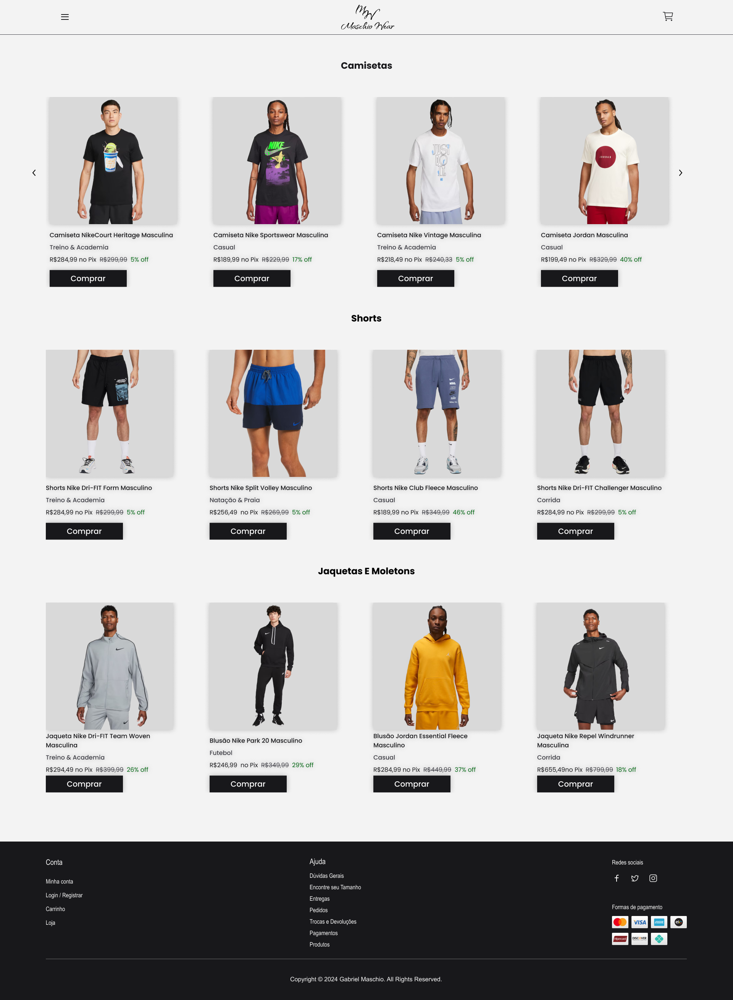
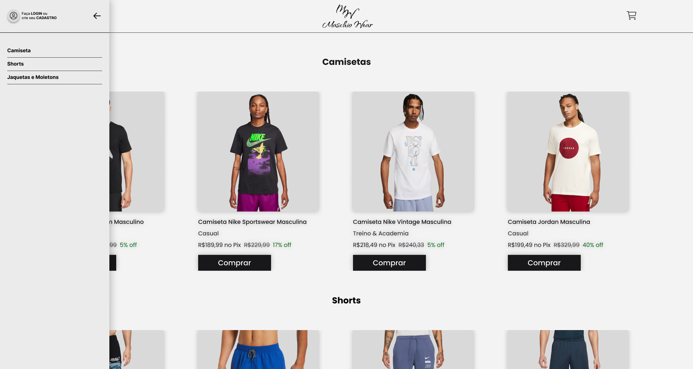
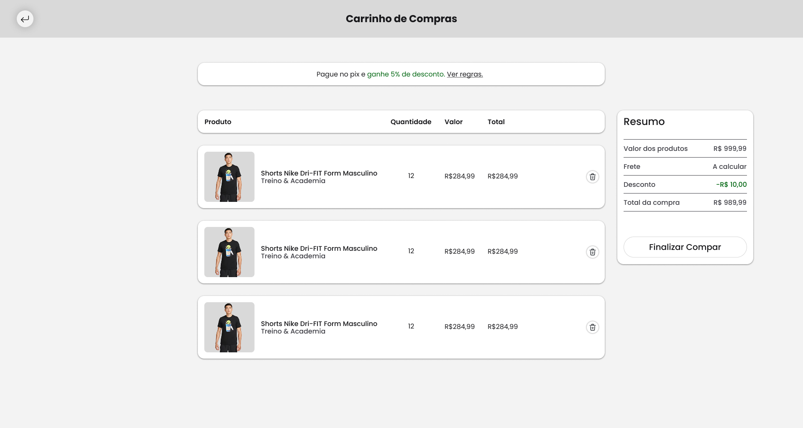

# 🛍 Loja de Roupas – Carrinho de Compras

Projeto desenvolvido como desafio acadêmico para a disciplina de Desenvolvimento de Sistemas Web I. O objetivo foi criar uma loja virtual com carrinho de compras funcional.

## 🔧 Tecnologias Utilizadas

- HTML
- CSS
- JavaScript
- PHP

## 📌 Funcionalidades

- Listagem de produtos
- Adição e remoção de itens no carrinho
- Cálculo automático de total
- Página dinâmica com interação entre PHP e JavaScript

## 🖼️ Protótipos

### Tela Inicial

### Menu da Tela Inicial

### Tela do Carrinho de Compras

## 💡 Diferenciais

- Uso de PHP integrado com JavaScript para maior dinamismo
- Layout limpo e responsivo
- Estrutura de código clara e modularizada

## 📄 Licença

Projeto acadêmico sem fins comerciais.  
Desenvolvido por Gabriel Maschio 👕

